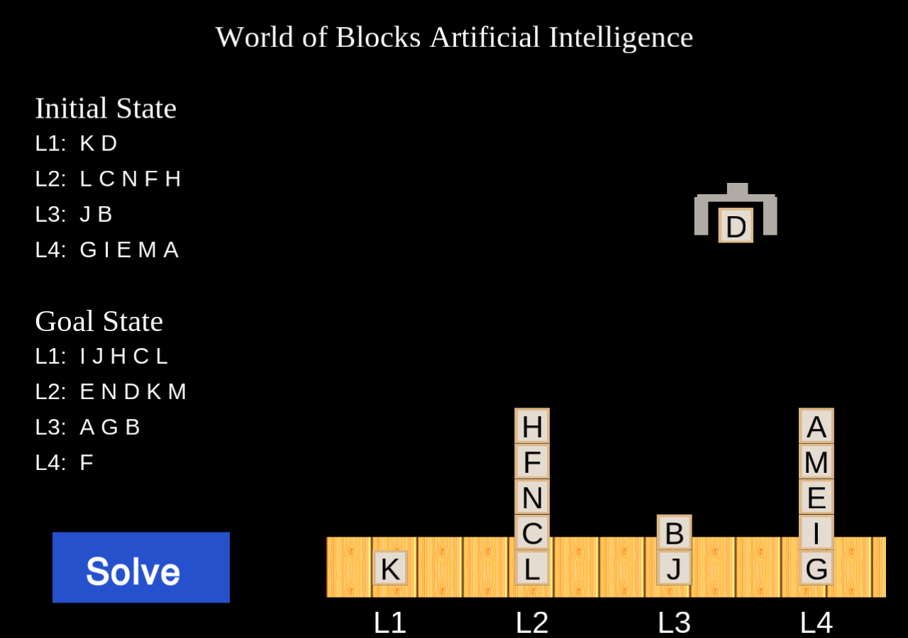

# World of Blocks AI Planning

Solving the famous [World of Blocks](https://en.wikipedia.org/wiki/Blocks_world) Artificial Intelligence problem using planning.

This problems describes an imaginary _robot arm_ moving about different lettered _blocks_ from an _**initial state**_ to a _**goal state**_ as described by the user. This problem is solved using a brute force **Planning** technique, using the language of STRIPS which is one of the most classic methods in Artificial Intelligence. It is a very loose interpretation. To represent the robot arm moving the blocks about, the Cocos2D game engine was used.



## Relations

In this version of the World of Blocks problem, the relations among the blocks include `ABOVE`, `ON`, `CLEAR`, and `TABLE`.

- The `ABOVE` relation describes whether a block is above another block.
- The `ON` relation describes a block being directly on top of another block.
- The `CLEAR` relation describes if a block has any blocks above or on top of it.
- The `TABLE` relation describes if a block is directly on a space on the table.

## Locations

There are four locations on the "table" being considered in this version of the World of Blocks problem. The locations are called `L1`, `L2`, `L3`, and `L4` Respectively.

## Actions

The actions that can be performed in this solution are as follows:

- `PICK-UP` - Robot arm picks up block from the table (TABLE STATE ONLY).
- `PUT-DOWN` - Robot arm puts block down block on table (TABLE STATE ONLY).
- `STACK` - Robot arm stacks a block from its hand onto another block.
- `UNSTACK` - Robot arm grabs a free block and holds it.
- `MOVE` - Robot arm moves a block from one location to another.
- `NOOP` - No operation; nothing happens, but time passes.

**NOTE:** Several of these actions require intermediate actions from the robot arm, including `HOLD`. For example, in order to `MOVE` a block from location `L2` to be `ON` another block, the robot arm must physically `HOLD` it between picking it up and actually completing the move.

## How To Use

When the program starts, it will ask for the user to input first the initial state and then for the goal state. The inputs are given at the command line and will load into the game window afterwards. The blocks are labelled with any symbol you choose, separated by commas. When you enter the symbols representing each block, start from the bottom and move upwards. When the program asks for L1 for the initial state, entering: `A, B, C` and pressing `enter` will generate 3 blocks with the letters A, B, and C respectively whith A being directly on the table at L1, B on top of A, and C on top of B.

After entering the initial and goal states, the UI will load. Simply press the **Solve** button and start solving!

## Set Up (Linux)
**BEFORE CONTINUING**

Please see [here](http://python.cocos2d.org/doc/programming_guide/installation.html) for installation instructions for Cocos2D, including `six` and `pyglet`. And of course you will be needing `python 3`. This will give you a full install of Cocos2D for other projects if you're interested. This guide will help you set up an environment for this particular project.
The setup will be similar in most operating systems, but there might be some slight differences.

**Create a Virtual Environment**

To set things up, we will want to create a virtual environment for Cocos2D. 
```bash
virtualenv cocos_env
```

To run this virtual environment so we can set everything up for it, we want to activate it by changing into the new directory and running the activate script
```bash
source cocos_env/bin/activate
```
Now we are running in a python virtual environment. From here, we can make custom installs for this project.

Install pyglet and Cocos2D.

```bash
pip3 install pyglet
pip3 install cocos2d
```